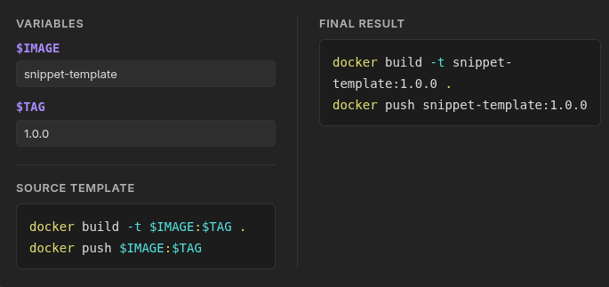

# Snippet Templater for Obsidian

**Snippet Templater** turns static code blocks and scripts into interactive, dynamic widgets inside Obsidian. It automatically parses variables, renders real-time input fields, and live-substitutes values into syntax-highlighted previews.




## ✨ Key Features

|   |   |
|---|---|
|**Feature**|**Description**|
|⚡ **Auto Variable Extraction**|Detects variables defined as `$VARIABLE` or `${VARIABLE}` instantly.|
|🎛️ **Live Inputs**|Generates neat input forms right above or beside your code block.|
|👁️ **Real-Time Preview**|Instant updating and substitution as you type into inputs.|
|🎨 **Syntax Highlighting**|Preserves full theme colors for Docker, Bash, Python, SQL, YAML, etc.|
|🏷️ **Multiple Fences**|Works with `snippet-templater`, `snippet-template`, and `script-template`.|
|💬 **Language Directives**|Define language via fence flags (`lang:python`) or first-line comments.|

## 🚀 Quick Start & Examples

Wrap your template code inside a supported code block identifier (`snippet-template`, `snippet-templater`, or `script-template`).

### 1. Bash / Docker Automation

````
```snippet-template lang:bash
docker build -t $IMAGE:$TAG .
docker push $IMAGE:$TAG
```
````

> **How it works:**
> 
> 1. Extracts `$IMAGE` and `$TAG` variables.
>     
> 2. Renders inputs for `IMAGE` and `TAG`.
>     
> 3. Generates a copy-pasteable script with filled values.
>     

### 2. Python Scripting

````
```script-template lang:python
import pandas as pd

df = pd.read_csv("${INPUT_FILE}")
filtered = df[df["status"] == "${STATUS}"]
filtered.to_json("${OUTPUT_FILE}")
```
````

### 3. SQL Query Template

````
```snippet-templater lang:sql
SELECT id, username, email, created_at
FROM users
WHERE status = '$USER_STATUS'
  AND created_at >= '$START_DATE'
LIMIT $LIMIT_COUNT;
```
````

## 📖 Syntax & Configuration

### Language Overrides

By default, language highlighting falls back to `bash`. You can specify a custom language in two ways:

1. **Header Flag**:
    
    ````
    ```snippet-template lang:python
    print("Hello, $NAME")
    ```
    ````
    
2. **Inline Comment Directive**:
    
    ````
    ```script-template
    // lang: typescript
    const user: string = "$USER_NAME";
    ```
    ````
    

### Variable Matching Rules

The parser recognizes variables following standard naming conventions (`[A-Za-z_][A-Za-z0-9_]*`):

- **Simple format**: `$VARIABLE_NAME`
    
- **Braced format**: `${VARIABLE_NAME}`
    

## ⚙️ Installation

### Option A: Manual Installation

1. Download `main.js`, `manifest.json`, and `styles.css` from the latest [Releases](https://github.com/gidragir/snippet-templater/releases "null").
    
2. Navigate to your vault's plugin directory:
    
    ```
    <VaultPath>/.obsidian/plugins/snippet-templater/
    ```
    
3. Place the downloaded files in that directory.
    
4. Reload Obsidian and enable **Snippet Templater** under **Settings → Community plugins**.
    

### Option B: Community Plugins _(Coming Soon)_

Once approved in the official Obsidian Community Catalog, search for `Snippet Templater` directly inside Obsidian's settings (**Settings → Community plugins**).

## 🛠️ Development

Requires **Node.js (v18+)** and **pnpm**.

```
# Install dependencies
pnpm install

# Start development mode (watch mode)
pnpm run dev

# Build for production
pnpm run build

# Run linter
pnpm run lint

# Trigger automated release
pnpm release
```

## 📄 License

This project is licensed under the [0-BSD License](https://gemini.google.com/LICENSE "null").